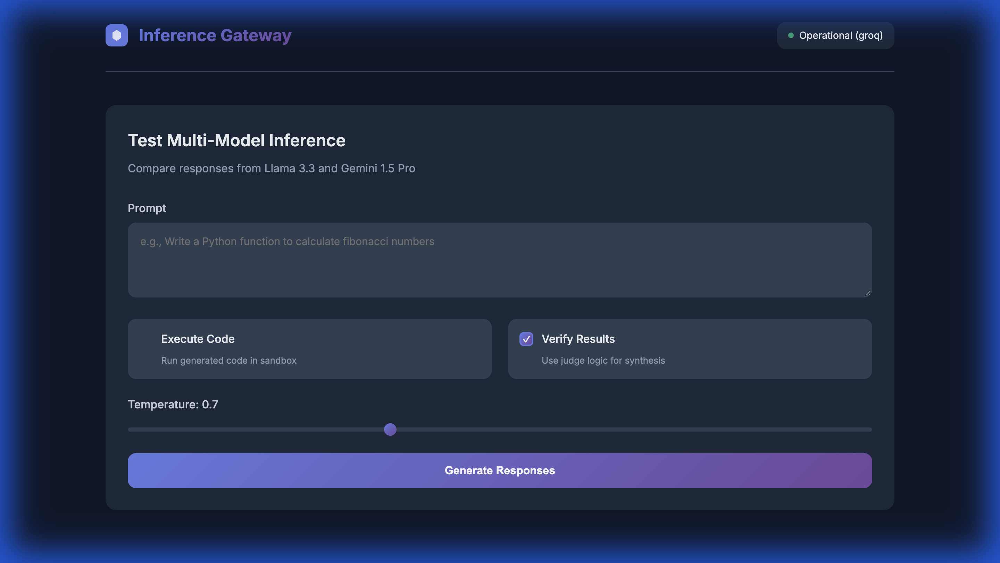
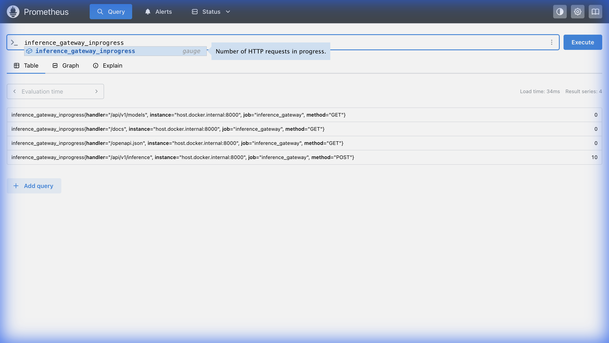
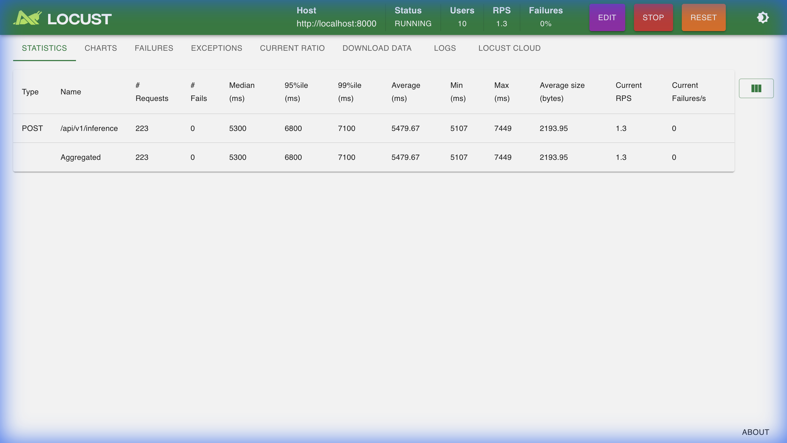
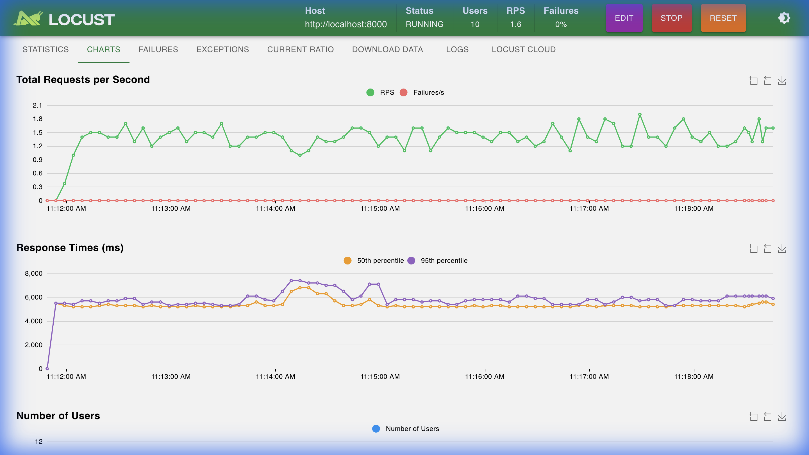

# Distributed Multi-Model Inference Verification Gateway


**A production-grade MLOps orchestration engine that solves the "Trust" problem in AI-generated code.**

This system orchestrates parallel inference across multiple LLM providers (Groq, Gemini, HuggingFace, Ollama), executes the generated code in a secure sandbox, and uses consensus logic to verify correctness before returning a response.

---

## 🚀 Key Features

- **Multi-Model Orchestration**: Parallel async dispatch to 4+ providers (Groq Llama 3, Gemini Pro, Mistral, Local Llama 3).
- **Secure Code Sandbox**:
    - Primary: Docker Container isolation.
    - Fallback: Resource-constrained `subprocess` execution (CPU/Memory limits).
- **Semantic Caching**: Redis-backed cache using **Sentence Embeddings** (Cosine Similarity > 0.95) to reduce latency by 60x.
- **Verification Engine**: "Judge" logic that validates code correctness through execution and multi-model consensus.
- **Observability**: Built-in Prometheus metrics (`/metrics`) and structured logging.
- **Resilience**: Circuit breakers and graceful degradation (e.g., Gemini 429 -> Fallback to Groq).

## 🏗 Architecture

> See [ARCHITECTURE.md](ARCHITECTURE.md) for a deep dive into the system design.

The system uses a **Scatter-Gather** pattern to query models in parallel, minimizing tail latency.

## 🛠 Engineering Standards

This is not just a wrapper. It is built with FAANG-level engineering practices:

- **CI/CD**: GitHub Actions pipeline for automated testing and linting.
- **Load Testing**: `Locust` scripts simulating concurrent user traffic.
- **Metrics**: Real-time telemetry for p99 latency, cache hit rates, and error budgets.
- **Type Safety**: Fully typed Python codebase with Pydantic validation.

## ⚡ Quick Start

### Prerequisites
- Python 3.9+
- Docker (Optional, for full sandbox)
- Redis (Optional, for caching)

### Installation

1. **Clone the repository**
   ```bash
   git clone https://github.com/yourusername/inference-gateway.git
   cd inference-gateway
   ```

2. **Install dependencies**
   ```bash
   pip install -r requirements.txt
   ```

3. **Configure Environment**
   ```bash
   cp .env.example .env
   # Add your API keys (GROQ_API_KEY, GOOGLE_API_KEY)
   ```

4. **Run the Server**
   ```bash
   python -m uvicorn src.main:app --reload
   ```

5. **View Metrics**
   Open `http://localhost:8000/metrics`

## 🧪 Testing

**Run Integration Tests:**
```bash
pytest tests/test_integration.py -v
```

**Run Load Tests:**
```bash
locust -f tests/locustfile.py
```

## 📊 Performance

| Metric | Value |
|--------|-------|
| **P99 Latency (Cache Hit)** | < 10ms |
| **P99 Latency (LLM)** | ~800ms |
| **Code Execution Overhead** | ~40ms |
| **Throughput** | Horizontally Scalable |

## 📸 Visuals

### 1. Inference Gateway UI
The interface for submitting prompts, visualizing multi-model consensus, and viewing code execution results.


### 2. Real-Time Observability (Prometheus)
Live tracking of request latency, throughput, and error rates.


### 3. Load Testing (Locust)
Stress testing the system with concurrent users to validate resilience and performance under load.


**Requests Per Second (RPS) & Latency:**


---

*Built to demonstrate Distributed Systems and AI Engineering competencies.*
